# AbhiMerger — Comprehensive Documentation

> **AbhiMerger** is a cross-platform Electron desktop application that automates the workflow of detecting PDF references inside Excel spreadsheets and merging them into a single PDF document.

---

## Table of Contents

1. [Overview](#1-overview)
2. [Getting Started](#2-getting-started)
3. [Architecture](#3-architecture)
4. [Electron Application Structure](#4-electron-application-structure)
5. [Inter-Process Communication](#5-inter-process-communication)
6. [Security Model](#6-security-model)
7. [Application Entry Points](#7-application-entry-points)
8. [Core Processing Systems](#8-core-processing-systems)
   - [Excel Processing](#81-excel-processing)
   - [PDF Operations](#82-pdf-operations)
9. [User Interface](#9-user-interface)
   - [Application Shell](#91-application-shell)
   - [Step 1: Excel Upload](#92-step-1-excel-upload)
   - [Step 2: Data Review](#93-step-2-data-review)
   - [Step 3: PDF Selection](#94-step-3-pdf-selection)
   - [Step 4: Merge Progress](#95-step-4-merge-progress)
   - [Step 5: Results Display](#96-step-5-results-display)
10. [Configuration and Deployment](#10-configuration-and-deployment)
    - [Project Configuration](#101-project-configuration)
    - [Asset Management](#102-asset-management)
    - [Progressive Web App Features](#103-progressive-web-app-features)
11. [Development Environment](#11-development-environment)

---

## 1. Overview

AbhiMerger solves a common productivity problem: consolidating many PDF documents whose file paths or URLs are scattered across an Excel spreadsheet into a single, ordered PDF file.

### Key Capabilities

| Capability | Detail |
|---|---|
| **Excel Parsing** | Reads `.xlsx` / `.xls` files, detects embedded hyperlinks and text-based PDF references |
| **Smart PDF Detection** | Identifies local paths, network (UNC) paths, relative paths, web URLs, Google Drive, Dropbox, OneDrive links |
| **Real-time Validation** | Checks each PDF for existence and accessibility before merging |
| **Bulk Merge** | Combines any subset of validated PDFs into one output file |
| **Progress Tracking** | Live per-file progress reported back to the UI |
| **Cross-Platform** | Ships as DMG (macOS), NSIS installer (Windows), AppImage/deb/rpm (Linux) |

### High-Level User Journey

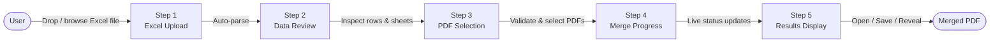
```mermaid
flowchart LR
    A([User]) -->|Drop / browse Excel file| B[Step 1\nExcel Upload]
    B -->|Auto-parse| C[Step 2\nData Review]
    C -->|Inspect rows & sheets| D[Step 3\nPDF Selection]
    D -->|Validate & select PDFs| E[Step 4\nMerge Progress]
    E -->|Live status updates| F[Step 5\nResults Display]
    F -->|Open / Save / Reveal| G([Merged PDF])
```

---

## 2. Getting Started

### Prerequisites

| Requirement | Minimum Version |
|---|---|
| Node.js | 16 |
| npm | 8 |
| Operating System | macOS 10.15+, Windows 10+, or any modern Linux distro |

### Installation

```bash
# 1. Clone the repository
git clone https://github.com/theabhishekar/AbhiMerger_app.git
cd AbhiMerger_app

# 2. Install all dependencies (production + dev)
npm install
```

### Running in Development Mode

```bash
npm run dev
```

This command uses **concurrently** to:
1. Start the React development server on `http://localhost:3000` (`npm run dev:renderer`)
2. Wait until port 3000 is ready (`wait-on`)
3. Launch Electron pointing at the local dev server

### Building for Production

```bash
# Build only the React bundle
npm run build

# Build React bundle + package Electron app for the current platform
npm run dist

# Build Electron installer for all platforms (requires correct OS toolchain)
npm run build:electron
```

### Quick-Start Flowchart

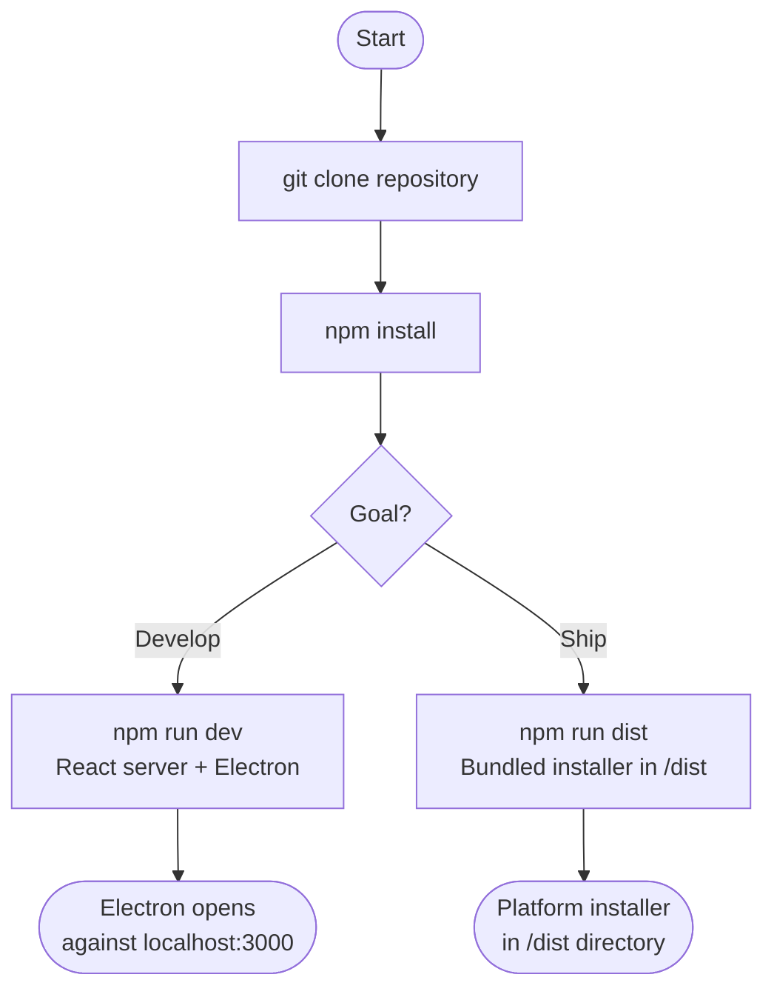
```mermaid
flowchart TD
    Start([Start]) --> Clone[git clone repository]
    Clone --> Install[npm install]
    Install --> Mode{Goal?}
    Mode -->|Develop| Dev[npm run dev\nReact server + Electron]
    Mode -->|Ship| Build[npm run dist\nBundled installer in /dist]
    Dev --> DevApp([Electron opens\nagainst localhost:3000])
    Build --> Installer([Platform installer\nin /dist directory])
```

---

## 3. Architecture

AbhiMerger follows the classic **Electron dual-process model**: a privileged **Main Process** running in Node.js and a sandboxed **Renderer Process** running the React UI in a Chromium browser context.

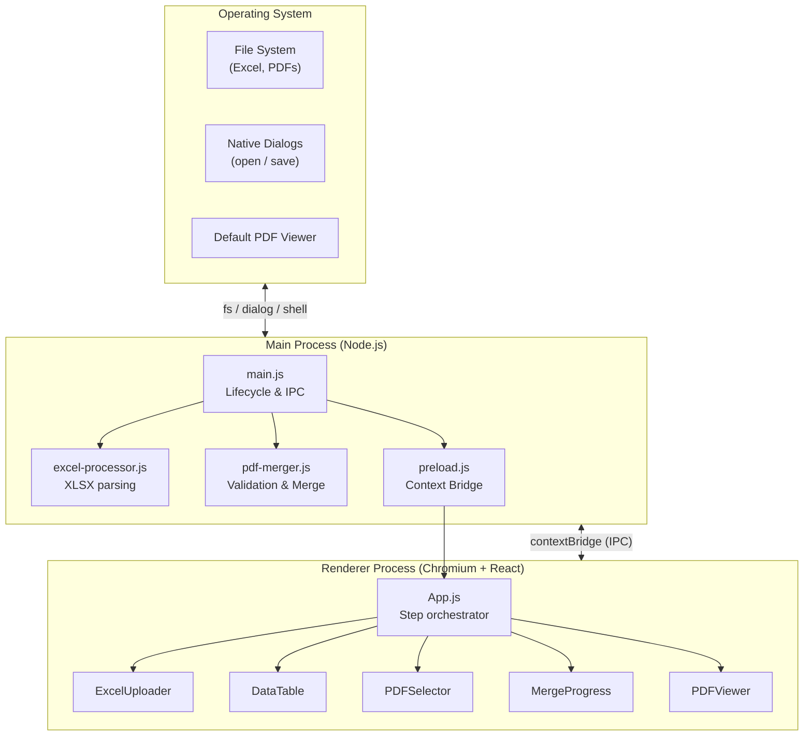
```mermaid
flowchart TB
    subgraph OS["Operating System"]
        FS["File System\n(Excel, PDFs)"]
        Dialog["Native Dialogs\n(open / save)"]
        Viewer["Default PDF Viewer"]
    end

    subgraph Main["Main Process (Node.js)"]
        MainJS["main.js\nLifecycle & IPC"]
        ExcelProc["excel-processor.js\nXLSX parsing"]
        PdfMerger["pdf-merger.js\nValidation & Merge"]
        Preload["preload.js\nContext Bridge"]
    end

    subgraph Renderer["Renderer Process (Chromium + React)"]
        AppJS["App.js\nStep orchestrator"]
        Upload["ExcelUploader"]
        Table["DataTable"]
        Selector["PDFSelector"]
        Progress["MergeProgress"]
        Viewer2["PDFViewer"]
    end

    OS <-->|"fs / dialog / shell"| Main
    Main <-->|"contextBridge (IPC)"| Renderer
    MainJS --> ExcelProc
    MainJS --> PdfMerger
    MainJS --> Preload
    Preload --> AppJS
    AppJS --> Upload
    AppJS --> Table
    AppJS --> Selector
    AppJS --> Progress
    AppJS --> Viewer2
```

### Technology Stack

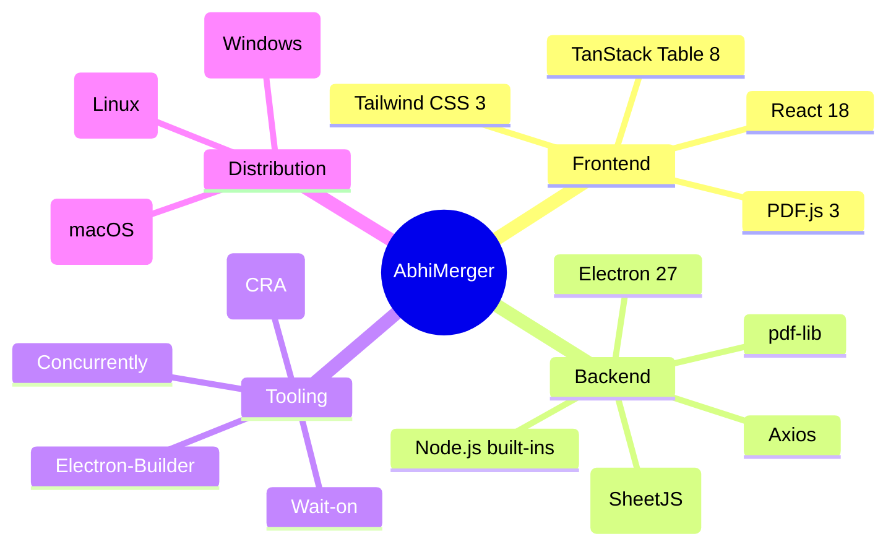
```mermaid
mindmap
  root((AbhiMerger))
    Frontend
      React 18
      TanStack Table 8
      Tailwind CSS 3
      PDF.js 3
    Backend
      Electron 27
      Node.js built-ins
      XLSX (SheetJS)
      pdf-lib
      Axios
    Tooling
      React Scripts (CRA)
      Electron-Builder
      Concurrently
      Wait-on
    Distribution
      DMG (macOS)
      NSIS (Windows)
      AppImage / deb / rpm (Linux)
```

---

## 4. Electron Application Structure

### Directory Layout

```
AbhiMerger_app/
├── assets/                    # Platform application icons
│   ├── icon.icns              # macOS (.icns)
│   ├── icon.ico               # Windows (.ico)
│   └── icon.png               # Linux / generic (.png)
│
├── public/                    # Static web resources served by CRA
│   ├── index.html             # HTML shell with loading screen
│   ├── electron.js            # Electron main entry (production fallback)
│   ├── manifest.json          # PWA manifest
│   └── favicon.ico            # Browser / taskbar favicon
│
├── src/
│   ├── index.js               # React DOM entry point
│   ├── App.js                 # Root component — 5-step state machine
│   ├── App.css                # Global & component styles
│   │
│   ├── components/            # Renderer-process React components
│   │   ├── ExcelUploader.js   # Step 1 — file upload UI
│   │   ├── DataTable.js       # Step 2 — interactive table (678 lines)
│   │   ├── PDFSelector.js     # Step 3 — PDF selection & validation
│   │   ├── MergeProgress.js   # Step 4 — real-time progress display
│   │   └── PDFViewer.js       # Step 5 — results & preview
│   │
│   └── main/                  # Main-process Node.js modules
│       ├── main.js            # App lifecycle, BrowserWindow, IPC handlers
│       ├── preload.js         # Secure contextBridge API surface
│       ├── excel-processor.js # XLSX parsing and PDF reference extraction
│       └── pdf-merger.js      # PDF validation, download, and merge
│
├── electron-start.js          # Dev-mode orchestration helper
├── test-hyperlinks.js         # Utility script for PDF hyperlink testing
├── package.json               # Project metadata, scripts, build config
└── package-lock.json          # Locked dependency tree
```

### Module Dependency Graph

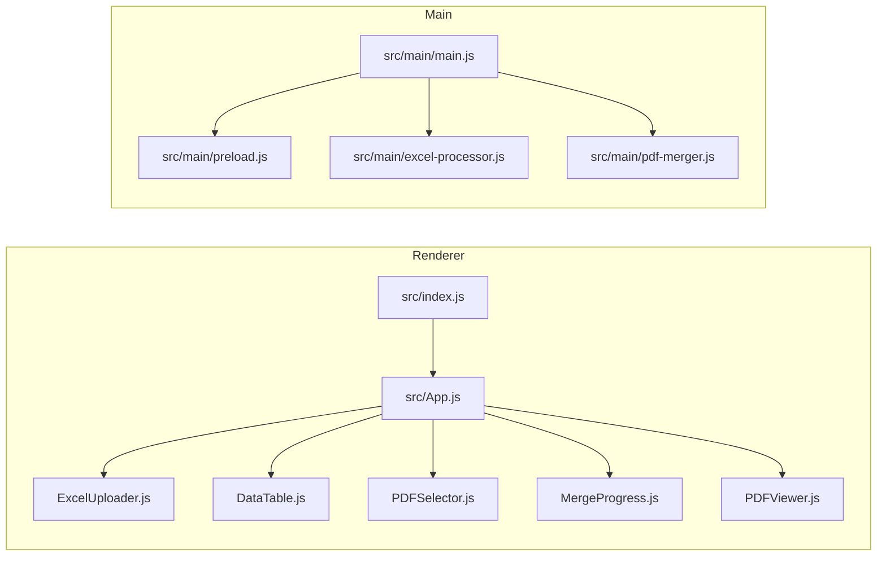
```mermaid
flowchart LR
    subgraph Renderer
        IndexJS["src/index.js"]
        AppComp["src/App.js"]
        EU["ExcelUploader.js"]
        DT["DataTable.js"]
        PS["PDFSelector.js"]
        MP["MergeProgress.js"]
        PV["PDFViewer.js"]
    end

    subgraph Main
        MainMod["src/main/main.js"]
        PreloadMod["src/main/preload.js"]
        ExcelMod["src/main/excel-processor.js"]
        PdfMod["src/main/pdf-merger.js"]
    end

    IndexJS --> AppComp
    AppComp --> EU
    AppComp --> DT
    AppComp --> PS
    AppComp --> MP
    AppComp --> PV

    MainMod --> PreloadMod
    MainMod --> ExcelMod
    MainMod --> PdfMod
```

---

## 5. Inter-Process Communication

Electron forbids direct calls between the Main and Renderer processes. All communication travels over **named IPC channels** using `ipcMain.handle` / `ipcRenderer.invoke` (request-response) and `ipcMain.emit` / `ipcRenderer.on` (event push).

### IPC Channel Map

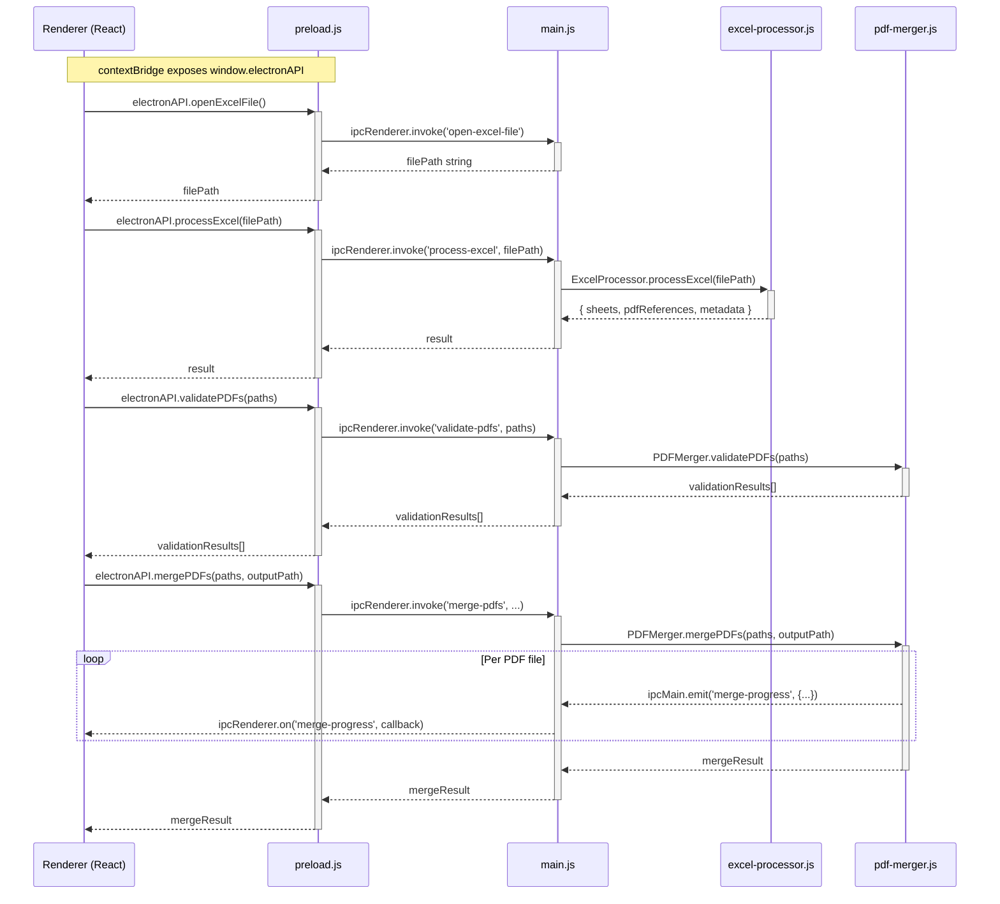
```mermaid
sequenceDiagram
    participant R as Renderer (React)
    participant P as preload.js
    participant M as main.js
    participant E as excel-processor.js
    participant PDF as pdf-merger.js

    Note over R,P: contextBridge exposes window.electronAPI

    R->>+P: electronAPI.openExcelFile()
    P->>+M: ipcRenderer.invoke('open-excel-file')
    M-->>-P: filePath string
    P-->>-R: filePath

    R->>+P: electronAPI.processExcel(filePath)
    P->>+M: ipcRenderer.invoke('process-excel', filePath)
    M->>+E: ExcelProcessor.processExcel(filePath)
    E-->>-M: { sheets, pdfReferences, metadata }
    M-->>-P: result
    P-->>-R: result

    R->>+P: electronAPI.validatePDFs(paths)
    P->>+M: ipcRenderer.invoke('validate-pdfs', paths)
    M->>+PDF: PDFMerger.validatePDFs(paths)
    PDF-->>-M: validationResults[]
    M-->>-P: validationResults[]
    P-->>-R: validationResults[]

    R->>+P: electronAPI.mergePDFs(paths, outputPath)
    P->>+M: ipcRenderer.invoke('merge-pdfs', ...)
    M->>+PDF: PDFMerger.mergePDFs(paths, outputPath)
    loop Per PDF file
        PDF-->>M: ipcMain.emit('merge-progress', {...})
        M-->>R: ipcRenderer.on('merge-progress', callback)
    end
    PDF-->>-M: mergeResult
    M-->>-P: mergeResult
    P-->>-R: mergeResult
```

### IPC Handlers Reference

| Channel | Direction | Handler | Description |
|---|---|---|---|
| `open-excel-file` | R → M | `dialog.showOpenDialog` | Opens native file picker filtered to `.xlsx`/`.xls` |
| `process-excel` | R → M | `ExcelProcessor.processExcel` | Parses Excel and returns data + PDF references |
| `validate-pdfs` | R → M | `PDFMerger.validatePDFs` | Checks each PDF path / URL for accessibility |
| `merge-pdfs` | R → M | `PDFMerger.mergePDFs` | Merges selected PDFs; emits progress events |
| `save-pdf-dialog` | R → M | `dialog.showSaveDialog` | Shows save-as dialog; returns chosen output path |
| `open-pdf` | R → M | `shell.openPath` | Opens file in OS default PDF viewer |
| `show-item-in-folder` | R → M | `shell.showItemInFolder` | Reveals file in OS file manager |
| `merge-progress` | M → R | `ipcRenderer.on` (push) | Per-file progress payload during merge |

### `merge-progress` Event Payload

```json
{
  "current":    2,
  "total":      10,
  "status":     "Merging file2.pdf...",
  "percentage": 20,
  "completed":  false,
  "error":      null
}
```

---

## 6. Security Model

AbhiMerger follows Electron security best practices to protect users from malicious content while preserving all required native capabilities.

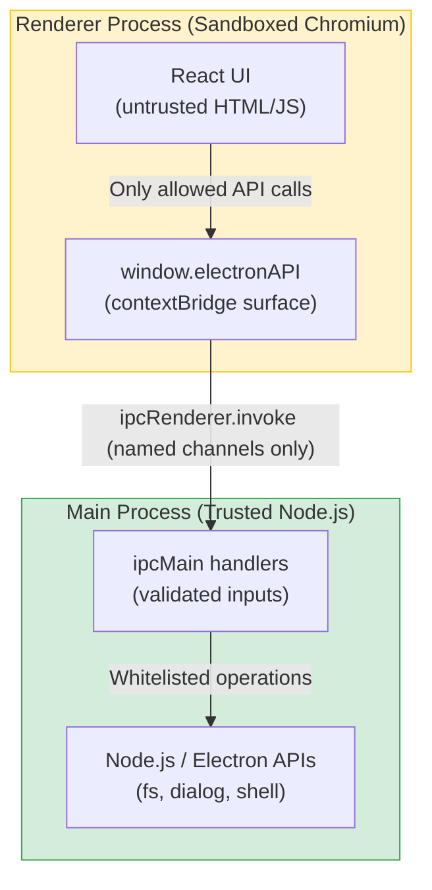
```mermaid
flowchart TD
    subgraph Renderer["Renderer Process (Sandboxed Chromium)"]
        React["React UI\n(untrusted HTML/JS)"]
        Bridge["window.electronAPI\n(contextBridge surface)"]
    end

    subgraph Main["Main Process (Trusted Node.js)"]
        IPC["ipcMain handlers\n(validated inputs)"]
        Node["Node.js / Electron APIs\n(fs, dialog, shell)"]
    end

    React -->|"Only allowed API calls"| Bridge
    Bridge -->|"ipcRenderer.invoke (named channels only)"| IPC
    IPC -->|"Whitelisted operations"| Node

    style Renderer fill:#fff3cd,stroke:#ffc107
    style Main fill:#d4edda,stroke:#28a745
```

### Security Properties

| Property | Value | Effect |
|---|---|---|
| `contextIsolation` | `true` | Renderer JS cannot access Node.js globals |
| `nodeIntegration` | `false` | No direct `require()` from renderer |
| `sandbox` | Electron default | Renderer runs in Chromium sandbox |
| `webSecurity` | `true` (default) | Standard same-origin policy enforced |
| `contextBridge` | Used in preload | Only `window.electronAPI` is exposed — nothing else |
| Remote module | Not used | Deprecated remote module is disabled |

### Preload API Surface

`src/main/preload.js` exposes exactly eight methods — no more:

```javascript
window.electronAPI = {
  openExcelFile(),          // invoke 'open-excel-file'
  processExcel(filePath),   // invoke 'process-excel'
  validatePDFs(pdfPaths),   // invoke 'validate-pdfs'
  mergePDFs(paths, output), // invoke 'merge-pdfs'
  savePDFDialog(),          // invoke 'save-pdf-dialog'
  openPDF(filePath),        // invoke 'open-pdf'
  showItemInFolder(path),   // invoke 'show-item-in-folder'
  onProgress(callback)      // on  'merge-progress'
}
```

---

## 7. Application Entry Points

AbhiMerger has **two distinct launch paths** — one for development and one for production.

### Development Launch Path

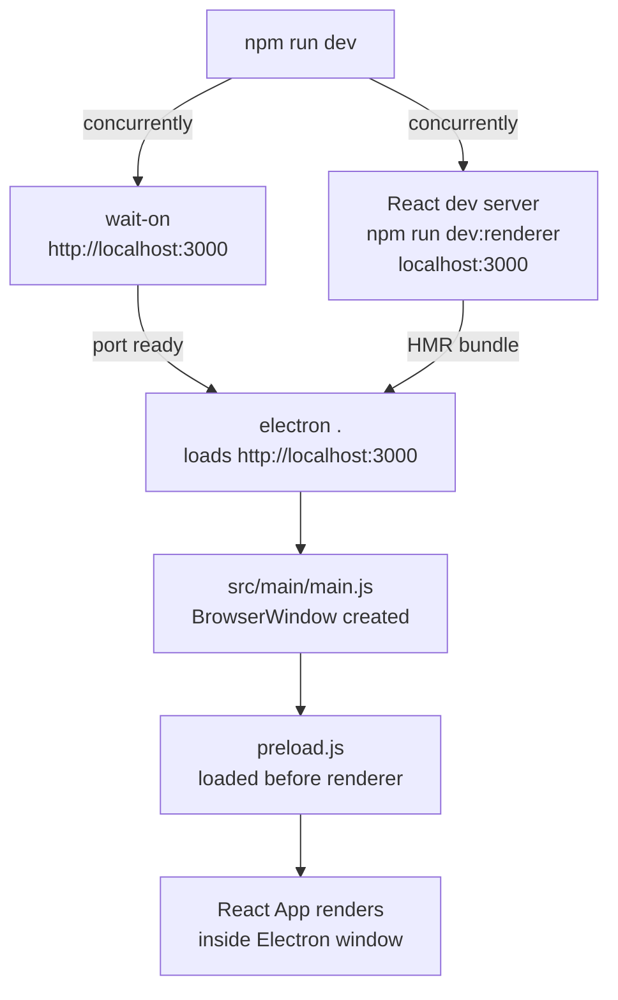
```mermaid
flowchart TD
    Dev["npm run dev"] -->|concurrently| ReactServer["React dev server\nnpm run dev:renderer\nlocalhost:3000"]
    Dev -->|concurrently| WaitOn["wait-on\nhttp://localhost:3000"]
    WaitOn -->|port ready| ElectronDev["electron .\nloads http://localhost:3000"]
    ReactServer -->|HMR bundle| ElectronDev
    ElectronDev --> MainJS["src/main/main.js\nBrowserWindow created"]
    MainJS --> Preload["preload.js\nloaded before renderer"]
    Preload --> ReactApp["React App renders\ninside Electron window"]
```

### Production Launch Path

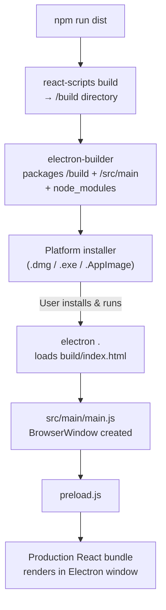
```mermaid
flowchart TD
    Dist["npm run dist"] --> BuildReact["react-scripts build\n→ /build directory"]
    BuildReact --> ElectronBuilder["electron-builder\npackages /build + /src/main\n+ node_modules"]
    ElectronBuilder --> Installer["Platform installer\n(.dmg / .exe / .AppImage)"]
    Installer -->|User installs & runs| ProdElectron["electron .\nloads build/index.html"]
    ProdElectron --> MainJS["src/main/main.js\nBrowserWindow created"]
    MainJS --> Preload["preload.js"]
    Preload --> ReactApp["Production React bundle\nrenders in Electron window"]
```

### Main Process Startup Sequence (`src/main/main.js`)

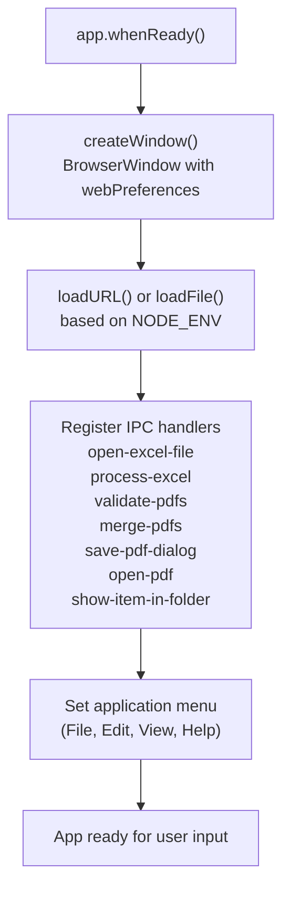
```mermaid
flowchart TD
    AppReady["app.whenReady()"] --> CreateWindow["createWindow()\nBrowserWindow with webPreferences"]
    CreateWindow --> LoadURL["loadURL() or loadFile()\nbased on NODE_ENV"]
    LoadURL --> RegisterHandlers["Register IPC handlers\nopen-excel-file\nprocess-excel\nvalidate-pdfs\nmerge-pdfs\nsave-pdf-dialog\nopen-pdf\nshow-item-in-folder"]
    RegisterHandlers --> AppMenu["Set application menu\n(File, Edit, View, Help)"]
    AppMenu --> Ready["App ready for user input"]
```

---

## 8. Core Processing Systems

### 8.1 Excel Processing

**File:** `src/main/excel-processor.js`

The Excel processor reads an `.xlsx` or `.xls` file, extracts all sheet data, and scans every cell for PDF references.

#### Excel Processing Flow

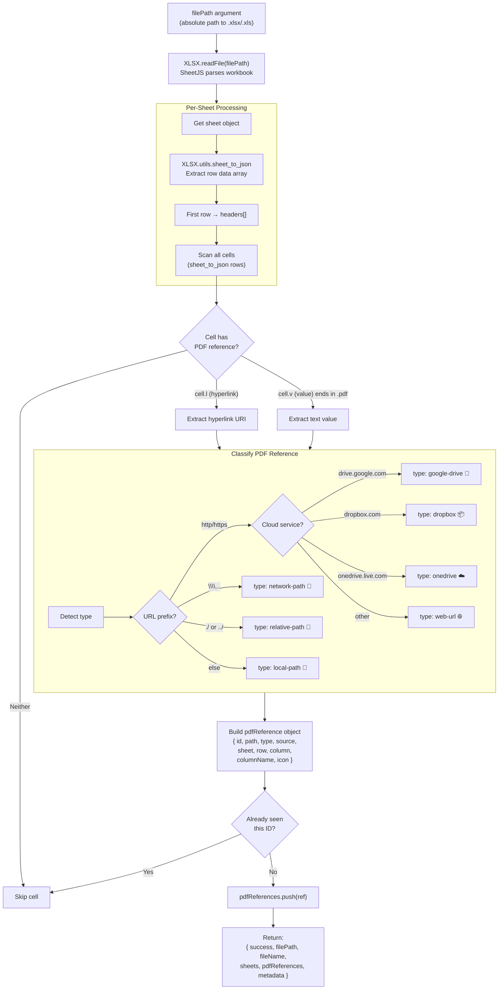
```mermaid
flowchart TD
    Input["filePath argument\n(absolute path to .xlsx/.xls)"] --> ReadFile["XLSX.readFile(filePath)\nSheetJS parses workbook"]
    ReadFile --> SheetLoop["Iterate over each sheet"]

    subgraph SheetLoop["Per-Sheet Processing"]
        GetSheet["Get sheet object"] --> AATJ["XLSX.utils.sheet_to_json\nExtract row data array"]
        AATJ --> HeaderRow["First row → headers[]"]
        HeaderRow --> ScanCells["Scan all cells\n(sheet_to_json rows)"]
    end

    ScanCells --> CellCheck{Cell has\nPDF reference?}
    CellCheck -->|"cell.l (hyperlink)"| HyperlinkExtract["Extract hyperlink URI"]
    CellCheck -->|"cell.v (value) ends in .pdf"| TextExtract["Extract text value"]
    CellCheck -->|Neither| Skip["Skip cell"]

    HyperlinkExtract --> Classify
    TextExtract --> Classify

    subgraph Classify["Classify PDF Reference"]
        ClassifyNode["Detect type"] --> TypeSwitch{URL prefix?}
        TypeSwitch -->|"http/https"| URLCheck{Cloud service?}
        URLCheck -->|drive.google.com| GDrive["type: google-drive 🔗"]
        URLCheck -->|dropbox.com| Dropbox["type: dropbox 📦"]
        URLCheck -->|onedrive.live.com| OneDrive["type: onedrive ☁️"]
        URLCheck -->|other| WebURL["type: web-url 🌐"]
        TypeSwitch -->|"\\\\..."| NetPath["type: network-path 🔗"]
        TypeSwitch -->|"./ or ../"| RelPath["type: relative-path 📄"]
        TypeSwitch -->|else| LocalPath["type: local-path 📁"]
    end

    Classify --> BuildRef["Build pdfReference object\n{ id, path, type, source,\nsheet, row, column,\ncolumnName, icon }"]
    BuildRef --> DedupCheck{Already seen\nthis ID?}
    DedupCheck -->|Yes| Skip
    DedupCheck -->|No| AddToList["pdfReferences.push(ref)"]

    AddToList --> ReturnResult["Return:\n{ success, filePath, fileName,\nsheets, pdfReferences, metadata }"]
```

#### PDF Reference Object Shape

```javascript
{
  id:         "Sheet1_R2_C3",      // unique cell coordinate key
  path:       "https://...",       // raw reference string
  type:       "google-drive",      // classification
  source:     "hyperlink",         // "hyperlink" | "text"
  sheet:      "Sheet1",
  row:        2,
  column:     3,
  columnName: "PDF Link",          // header of that column
  icon:       "🔗",                // display emoji
  exists:     null,                // filled in by validate step
  selected:   true                 // user toggle in Step 3
}
```

### 8.2 PDF Operations

**File:** `src/main/pdf-merger.js`

The PDF module handles two distinct operations: **validation** (checking accessibility) and **merging** (downloading and combining).

#### PDF Validation Flow

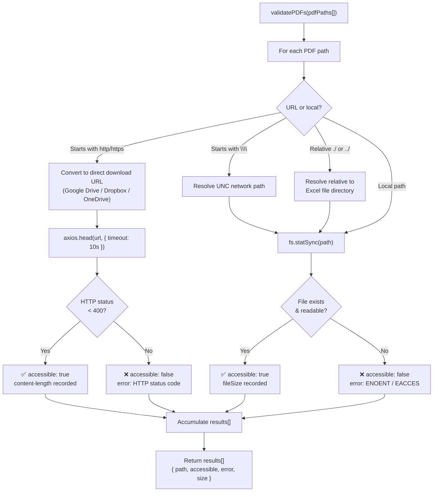
```mermaid
flowchart TD
    ValidateInput["validatePDFs(pdfPaths[])"] --> Loop["For each PDF path"]

    Loop --> TypeCheck{URL or local?}

    TypeCheck -->|"Starts with http/https"| CloudConvert["Convert to direct download URL\n(Google Drive / Dropbox / OneDrive)"]
    CloudConvert --> HeadReq["axios.head(url, { timeout: 10s })"]
    HeadReq --> StatusCheck{HTTP status\n< 400?}
    StatusCheck -->|Yes| ValidWeb["✅ accessible: true\ncontent-length recorded"]
    StatusCheck -->|No| InvalidWeb["❌ accessible: false\nerror: HTTP status code"]

    TypeCheck -->|"Starts with \\\\"| UNCResolve["Resolve UNC network path"]
    UNCResolve --> FSCheck

    TypeCheck -->|"Relative ./ or ../"| RelResolve["Resolve relative to\nExcel file directory"]
    RelResolve --> FSCheck

    TypeCheck -->|Local path| FSCheck["fs.statSync(path)"]
    FSCheck --> ExistsCheck{File exists\n& readable?}
    ExistsCheck -->|Yes| ValidLocal["✅ accessible: true\nfileSize recorded"]
    ExistsCheck -->|No| InvalidLocal["❌ accessible: false\nerror: ENOENT / EACCES"]

    ValidWeb & ValidLocal --> Results["Accumulate results[]"]
    InvalidWeb & InvalidLocal --> Results
    Results --> ReturnValidation["Return results[]\n{ path, accessible, error, size }"]
```

#### PDF Merge Flow

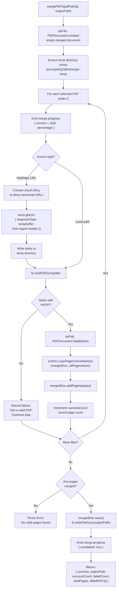
```mermaid
flowchart TD
    MergeInput["mergePDFs(pdfPaths[], outputPath)"] --> CreatePDF["pdf-lib: PDFDocument.create()\nempty merged document"]

    CreatePDF --> EnsureTmp["Ensure temp directory exists\n{os.tmpdir()}/abhimerger-temp"]

    EnsureTmp --> FileLoop["For each selected PDF (index i)"]

    FileLoop --> EmitStart["Emit merge-progress\n{ current: i, total, percentage }"]

    EmitStart --> SourceCheck{Source type?}

    SourceCheck -->|"http/https URL"| ConvertURL["Convert cloud URLs\nto direct download URLs"]
    ConvertURL --> DownloadPDF["axios.get(url,\n{ responseType: 'arraybuffer',\nUser-Agent header })"]
    DownloadPDF --> SaveTemp["Write bytes to\ntemp directory"]
    SaveTemp --> ReadBytes["Read bytes from temp file"]

    SourceCheck -->|Local path| ReadBytes["fs.readFileSync(path)"]

    ReadBytes --> MagicCheck{Starts with\n%PDF?}
    MagicCheck -->|No| RecordFail["Record failure:\n'Not a valid PDF'\nContinue loop"]

    MagicCheck -->|Yes| LoadPDF["pdf-lib: PDFDocument.load(bytes)"]
    LoadPDF --> CopyPages["srcDoc.copyPagesToAnotherDoc\n(mergedDoc, allPageIndices)"]
    CopyPages --> AppendPages["mergedDoc.addPages(pages)"]
    AppendPages --> RecordSuccess["Increment successCount\nrecord page count"]

    RecordFail & RecordSuccess --> NextFile{More files?}
    NextFile -->|Yes| FileLoop
    NextFile -->|No| CheckPages{Any pages\nmerged?}

    CheckPages -->|No| ThrowError["Throw Error:\n'No valid pages found'"]
    CheckPages -->|Yes| SaveOutput["mergedDoc.save()\nfs.writeFileSync(outputPath)"]

    SaveOutput --> EmitComplete["Emit merge-progress\n{ completed: true }"]
    EmitComplete --> ReturnResult["Return:\n{ success, outputPath,\nsuccessCount, failedCount,\ntotalPages, failedPDFs[] }"]
```

#### URL Normalisation for Cloud Storage

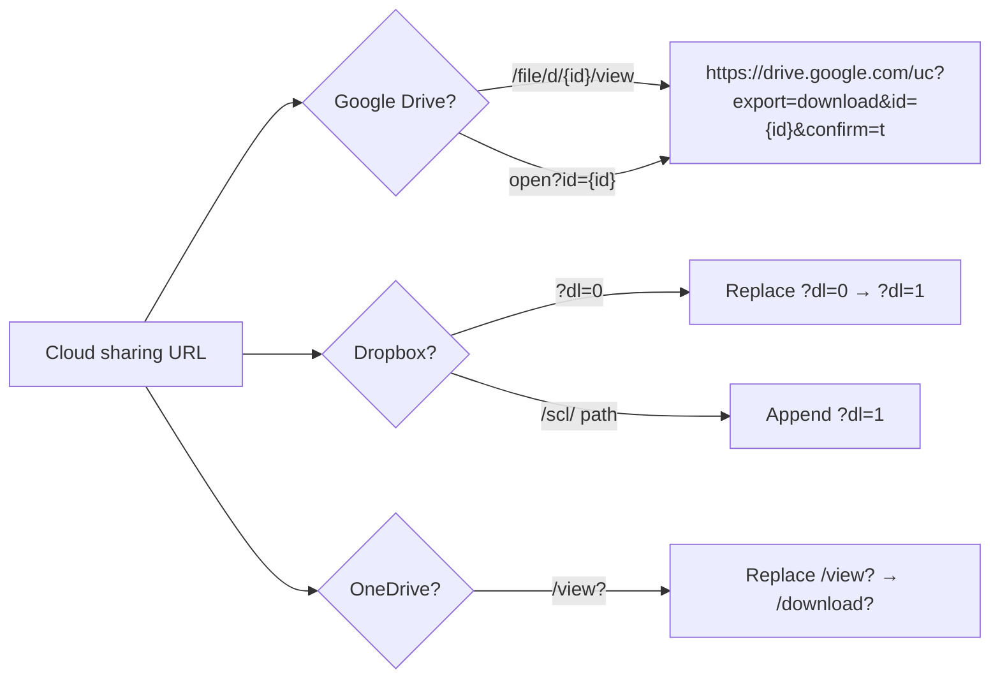
```mermaid
flowchart LR
    Input["Cloud sharing URL"] --> GD{Google Drive?}
    GD -->|"/file/d/{id}/view"| GDOut["https://drive.google.com/uc?export=download&id={id}&confirm=t"]
    GD -->|"open?id={id}"| GDOut

    Input --> DB{Dropbox?}
    DB -->|"?dl=0"| DBOut["Replace ?dl=0 → ?dl=1"]
    DB -->|"/scl/ path"| DBOut2["Append ?dl=1"]

    Input --> OD{OneDrive?}
    OD -->|"/view?"| ODOut["Replace /view? → /download?"]
```

---

## 9. User Interface

### 9.1 Application Shell

**File:** `src/App.js`

`App.js` is the **root state machine** that owns the current step, all shared data, and the transition logic between the five workflow steps.

#### Step State Machine

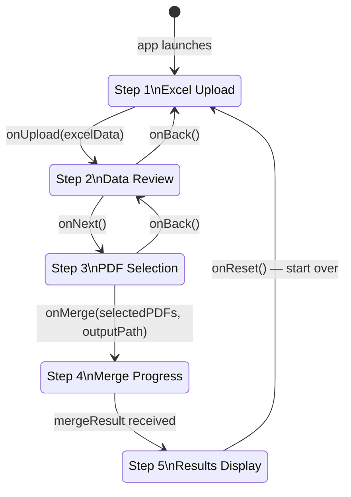
```mermaid
stateDiagram-v2
    [*] --> Step1 : app launches

    Step1 : Step 1\nExcel Upload
    Step2 : Step 2\nData Review
    Step3 : Step 3\nPDF Selection
    Step4 : Step 4\nMerge Progress
    Step5 : Step 5\nResults Display

    Step1 --> Step2 : onUpload(excelData)
    Step2 --> Step3 : onNext()
    Step2 --> Step1 : onBack()
    Step3 --> Step4 : onMerge(selectedPDFs, outputPath)
    Step3 --> Step2 : onBack()
    Step4 --> Step5 : mergeResult received
    Step5 --> Step1 : onReset() — start over
```

#### App-Level State

| State Variable | Type | Description |
|---|---|---|
| `currentStep` | `number` (1–5) | Active step in the workflow |
| `excelData` | `object` | Parsed result from `processExcel` |
| `selectedPDFs` | `string[]` | PDF paths chosen in Step 3 |
| `outputPath` | `string` | Absolute path for the merged output file |
| `mergeResult` | `object` | Final result from `mergePDFs` |
| `progressData` | `object` | Latest `merge-progress` IPC payload |

#### Step Render Logic

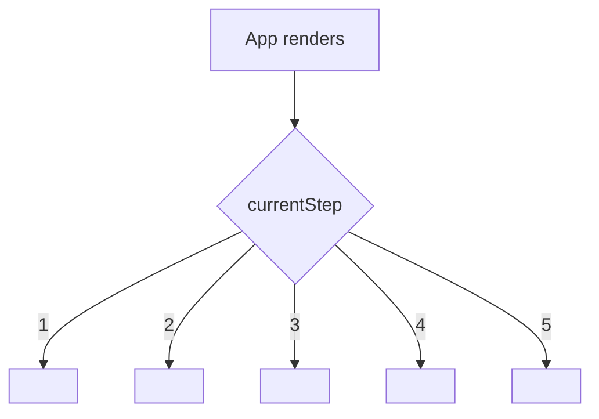
```mermaid
flowchart TD
    AppRender["App renders"] --> StepSwitch{currentStep}
    StepSwitch -->|1| RenderUpload["<ExcelUploader\nonUpload={handleUpload} />"]
    StepSwitch -->|2| RenderTable["<DataTable\nexcelData={excelData}\nonNext={goToStep3}\nonBack={goToStep1} />"]
    StepSwitch -->|3| RenderSelector["<PDFSelector\npdfReferences={...}\nonMerge={handleMerge}\nonBack={goToStep2} />"]
    StepSwitch -->|4| RenderProgress["<MergeProgress\nprogressData={progressData} />"]
    StepSwitch -->|5| RenderViewer["<PDFViewer\nmergeResult={mergeResult}\nonReset={handleReset} />"]
```

---

### 9.2 Step 1: Excel Upload

**File:** `src/components/ExcelUploader.js`

Provides the initial landing UI for ingesting an Excel file via **click-to-browse** or **drag-and-drop**.

#### Component Flow

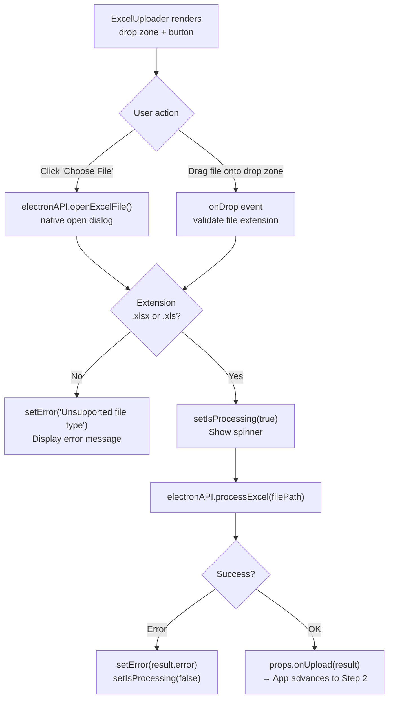
```mermaid
flowchart TD
    Render["ExcelUploader renders\ndrop zone + button"] --> UserAction{User action}

    UserAction -->|"Click 'Choose File'"| OpenDialog["electronAPI.openExcelFile()\nnative open dialog"]
    UserAction -->|"Drag file onto drop zone"| DragDrop["onDrop event\nvalidate file extension"]

    OpenDialog --> ValidateExt{Extension\n.xlsx or .xls?}
    DragDrop --> ValidateExt

    ValidateExt -->|No| ShowError["setError('Unsupported file type')\nDisplay error message"]
    ValidateExt -->|Yes| SetProcessing["setIsProcessing(true)\nShow spinner"]

    SetProcessing --> CallProcess["electronAPI.processExcel(filePath)"]
    CallProcess --> ParseResult{Success?}

    ParseResult -->|Error| ShowError2["setError(result.error)\nsetIsProcessing(false)"]
    ParseResult -->|OK| CallOnUpload["props.onUpload(result)\n→ App advances to Step 2"]
```

#### State Variables

| Variable | Default | Description |
|---|---|---|
| `isDragOver` | `false` | Highlights drop zone when file is dragged over |
| `isProcessing` | `false` | Shows loading spinner during IPC call |
| `error` | `null` | Displays validation or processing error text |

---

### 9.3 Step 2: Data Review

**File:** `src/components/DataTable.js` (678 lines)

Renders the parsed Excel data in a **fully interactive table** with search, sort, multi-sheet navigation, and row expansion.

#### Component Flow

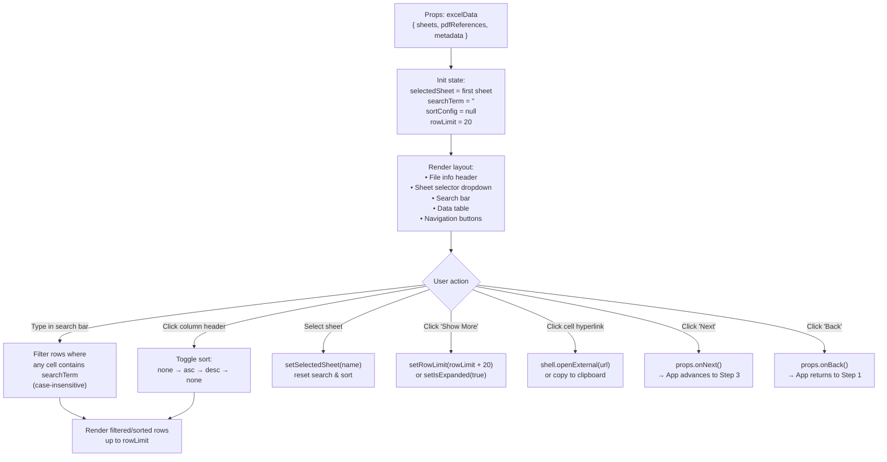
```mermaid
flowchart TD
    Props["Props: excelData\n{ sheets, pdfReferences, metadata }"] --> InitState["Init state:\nselectedSheet = first sheet\nsearchTerm = ''\nsortConfig = null\nrowLimit = 20"]

    InitState --> RenderLayout["Render layout:\n• File info header\n• Sheet selector dropdown\n• Search bar\n• Data table\n• Navigation buttons"]

    RenderLayout --> UserAction{User action}

    UserAction -->|"Type in search bar"| Filter["Filter rows where\nany cell contains searchTerm\n(case-insensitive)"]
    UserAction -->|"Click column header"| Sort["Toggle sort:\nnone → asc → desc → none"]
    UserAction -->|"Select sheet"| SwitchSheet["setSelectedSheet(name)\nreset search & sort"]
    UserAction -->|"Click 'Show More'"| Expand["setRowLimit(rowLimit + 20)\nor setIsExpanded(true)"]
    UserAction -->|"Click cell hyperlink"| OpenLink["shell.openExternal(url)\nor copy to clipboard"]
    UserAction -->|"Click 'Next'"| CallOnNext["props.onNext()\n→ App advances to Step 3"]
    UserAction -->|"Click 'Back'"| CallOnBack["props.onBack()\n→ App returns to Step 1"]

    Filter & Sort --> RenderRows["Render filtered/sorted rows\nup to rowLimit"]
```

#### Features Summary

| Feature | Implementation |
|---|---|
| Multi-sheet navigation | Dropdown of sheet names; each has independent data |
| Full-text search | Client-side filter over all cell string values |
| Column sort | Click header to cycle `none → asc → desc` |
| Row expansion | Show first 20 rows; "Show More" increments by 20 |
| Hyperlink detection | Renders PDF-reference cells with link icon |
| PDF reference highlighting | Cells with PDF references are highlighted |
| Metadata panel | Displays file name, sheet count, row count, PDF count |

---

### 9.4 Step 3: PDF Selection

**File:** `src/components/PDFSelector.js` (415 lines)

Allows users to review detected PDF references, run real-time validation, and choose which PDFs to include in the merge.

#### Component Flow

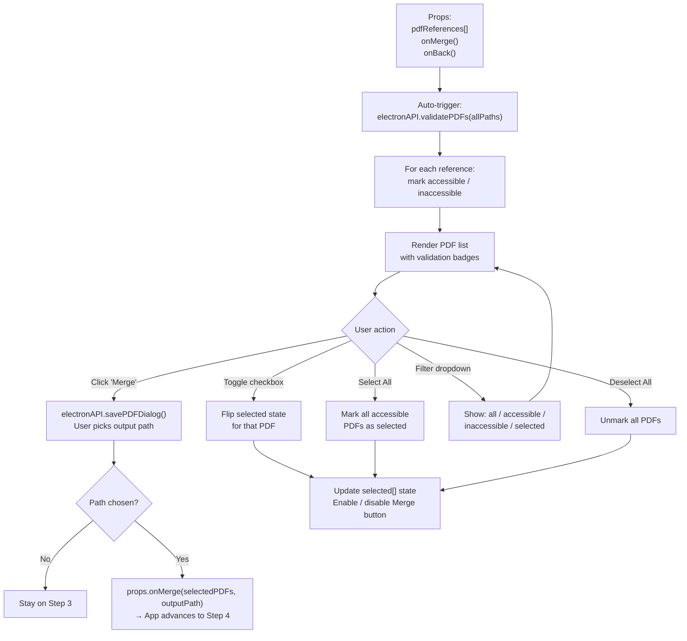
```mermaid
flowchart TD
    Props["Props:\npdfReferences[]\nonMerge()\nonBack()"] --> ValidateAuto["Auto-trigger:\nelectronAPI.validatePDFs(allPaths)"]

    ValidateAuto --> ValidationLoop["For each reference:\nmark accessible / inaccessible"]

    ValidationLoop --> RenderList["Render PDF list\nwith validation badges"]

    RenderList --> UserAction{User action}

    UserAction -->|"Toggle checkbox"| ToggleSelect["Flip selected state\nfor that PDF"]
    UserAction -->|"Select All"| SelectAll["Mark all accessible\nPDFs as selected"]
    UserAction -->|"Deselect All"| DeselectAll["Unmark all PDFs"]
    UserAction -->|"Filter dropdown"| FilterView["Show: all / accessible /\ninaccessible / selected"]
    UserAction -->|"Click 'Merge'"| ChooseOutput["electronAPI.savePDFDialog()\nUser picks output path"]

    ChooseOutput --> PathCheck{Path chosen?}
    PathCheck -->|No| Stay["Stay on Step 3"]
    PathCheck -->|Yes| CallOnMerge["props.onMerge(selectedPDFs, outputPath)\n→ App advances to Step 4"]

    ToggleSelect & SelectAll & DeselectAll --> UpdateSelected["Update selected[] state\nEnable / disable Merge button"]
    FilterView --> RenderList
```

#### PDF Status Badges

| Badge | Meaning |
|---|---|
| ✅ Accessible | File or URL is reachable |
| ❌ Inaccessible | File not found / URL unreachable |
| ⏳ Validating | Async check in progress |
| 🔘 Unchecked | Validation not yet started |

---

### 9.5 Step 4: Merge Progress

**File:** `src/components/MergeProgress.js` (146 lines)

Displays real-time per-file progress while the Main process is merging PDFs.

#### Progress Display Flow

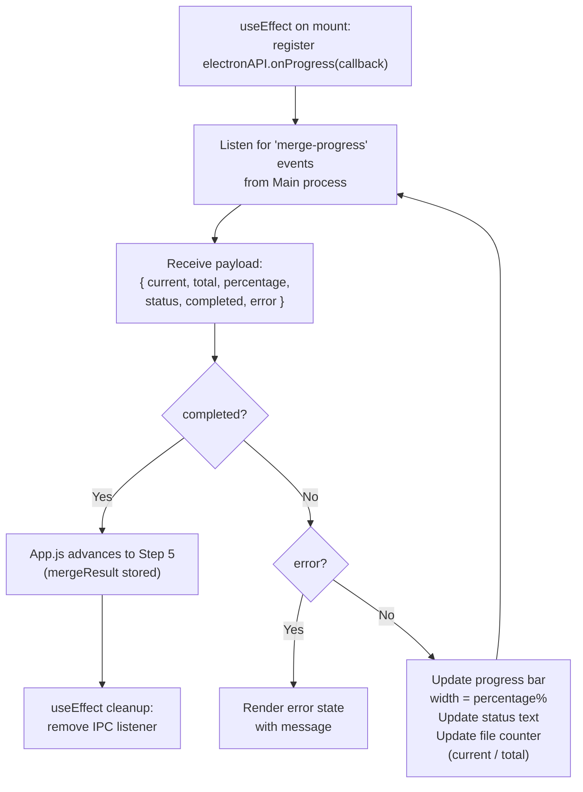
```mermaid
flowchart TD
    MountEffect["useEffect on mount:\nregister electronAPI.onProgress(callback)"] --> Listen["Listen for 'merge-progress' events\nfrom Main process"]

    Listen --> Payload["Receive payload:\n{ current, total, percentage,\nstatus, completed, error }"]

    Payload --> CompletedCheck{completed?}

    CompletedCheck -->|Yes| Advance["App.js advances to Step 5\n(mergeResult stored)"]

    CompletedCheck -->|No| ErrorCheck{error?}
    ErrorCheck -->|Yes| ShowError["Render error state\nwith message"]
    ErrorCheck -->|No| UpdateUI["Update progress bar\nwidth = percentage%\nUpdate status text\nUpdate file counter\n(current / total)"]

    UpdateUI --> Listen

    Advance --> UnmountCleanup["useEffect cleanup:\nremove IPC listener"]
```

#### Visual Elements

| Element | Description |
|---|---|
| **Progress bar** | Animated fill from 0 → 100 % using `percentage` |
| **Status text** | File name or stage description from `status` |
| **File counter** | `{current} of {total} PDFs processed` |
| **Spinner** | Pulsing animation while in progress |
| **Error box** | Red alert with message when `error` is truthy |

---

### 9.6 Step 5: Results Display

**File:** `src/components/PDFViewer.js` (167 lines)

Shows the outcome of the merge operation with actionable buttons and a summary report.

#### Results Display Flow

```mermaid
flowchart TD
    Props["Props:\nmergeResult { success, outputPath,\nsuccessCount, failedCount,\ntotalPages, failedPDFs[] }\nonReset()"] --> SuccessCheck{mergeResult.success?}

    SuccessCheck -->|Yes| RenderSuccess["Render success screen:\n✅ icon\nFile path\nPage count\nSuccess / fail counts\nAction buttons"]

    SuccessCheck -->|No| RenderError["Render error screen:\n❌ icon\nError message\n'Start Over' button"]

    RenderSuccess --> UserAction{User action}

    UserAction -->|"Open PDF"| OpenPDF["electronAPI.openPDF(outputPath)\nOS default PDF viewer"]
    UserAction -->|"Show in Folder"| ShowFolder["electronAPI.showItemInFolder\n(outputPath)"]
    UserAction -->|"Merge Again"| CallOnReset["props.onReset()\n→ App resets to Step 1"]
    UserAction -->|"View Failed PDFs"| ExpandFailed["Toggle failed PDFs list\nshowing paths + error messages"]
```

#### Merge Summary Report

| Field | Description |
|---|---|
| `outputPath` | Absolute path to the saved merged PDF |
| `totalPages` | Total number of pages in the merged file |
| `successCount` | Number of PDFs successfully merged |
| `failedCount` | Number of PDFs that failed |
| `failedPDFs[]` | Array of `{ path, error }` for each failure |

---

## 10. Configuration and Deployment

### 10.1 Project Configuration

#### `package.json` Key Sections

```json
{
  "name": "abhimerger",
  "version": "1.0.0",
  "main": "src/main/main.js",
  "homepage": "./",
  "scripts": {
    "start":          "electron .",
    "dev":            "concurrently \"npm run dev:renderer\" \"wait-on http://localhost:3000 && electron .\"",
    "dev:renderer":   "react-scripts start",
    "build":          "react-scripts build",
    "build:electron": "npm run build && electron-builder",
    "dist":           "npm run build && electron-builder --publish=never",
    "pack":           "electron-builder --dir"
  }
}
```

#### Electron-Builder Configuration

```mermaid
flowchart TD
    EB["electron-builder"] --> Files["Packaged files:\nbuild/**/*\nsrc/main/**/*\nnode_modules/**/*"]

    EB --> MacOS["macOS\ntarget: DMG\nicon: assets/icon.icns\ncategory: productivity"]
    EB --> Windows["Windows\ntarget: NSIS installer\nicon: assets/icon.ico\noneClick: false\nallowDirectoryChange: true"]
    EB --> Linux["Linux\ntargets: AppImage, .deb, .rpm\nicon: assets/icon.png"]

    EB --> Output["Output directory: /dist"]
```

#### Build Pipeline

```mermaid
flowchart LR
    Source["Source Code\n(src/)"] -->|"react-scripts build"| Bundle["React Bundle\n(build/)"]
    Bundle -->|"electron-builder"| Packages["Platform Packages\n(dist/)"]
    Packages --> DMG["AbhiMerger.dmg\n(macOS)"]
    Packages --> EXE["AbhiMergerSetup.exe\n(Windows NSIS)"]
    Packages --> AppImage["AbhiMerger.AppImage\n(Linux)"]
    Packages --> DEB["abhimerger.deb\n(Debian/Ubuntu)"]
    Packages --> RPM["abhimerger.rpm\n(Fedora/RHEL)"]
```

### 10.2 Asset Management

Platform icons are stored under the `/assets` directory and referenced by Electron-Builder during packaging:

| File | Format | Platform | Size |
|---|---|---|---|
| `assets/icon.icns` | Apple Icon Image | macOS | 636 KB |
| `assets/icon.ico` | Windows Icon | Windows | 72 KB |
| `assets/icon.png` | PNG | Linux / generic | 1.3 MB |

```mermaid
flowchart TD
    AssetDir["/assets directory"] --> ICNS["icon.icns → macOS app bundle\nDock icon, Finder, Spotlight"]
    AssetDir --> ICO["icon.ico → Windows installer\nTaskbar, Start Menu, Desktop"]
    AssetDir --> PNG["icon.png → Linux packages\nApplication grid, Taskbar"]

    PublicDir["/public directory"] --> Favicon["favicon.ico → browser tab icon\n(dev mode & web fallback)"]
    PublicDir --> Manifest["manifest.json → PWA icon\nreferences favicon.ico"]
```

### 10.3 Progressive Web App Features

The React bundle is configured as a PWA via `public/manifest.json`, enabling potential browser-based usage as a fallback to the Electron desktop app.

#### PWA Manifest

```json
{
  "short_name": "AbhiMerger",
  "name":       "AbhiMerger - Excel to PDF Merger",
  "icons": [
    {
      "src":   "favicon.ico",
      "sizes": "64x64 32x32 24x24 16x16",
      "type":  "image/x-icon"
    }
  ],
  "start_url":        ".",
  "display":          "standalone",
  "theme_color":      "#667eea",
  "background_color": "#ffffff"
}
```

#### PWA Features in Context

```mermaid
flowchart LR
    subgraph ElectronContext["Electron (Primary)"]
        NativeApp["Full native app\nFile system access\nNative dialogs\nAuto-updater"]
    end

    subgraph BrowserContext["Browser / PWA (Fallback)"]
        PWA["Standalone display mode\nInstallable on desktop\nTheme colour #667eea\nNo browser chrome"]
    end

    Manifest["public/manifest.json"] --> PWA
    HTMLMeta["<meta name=theme-color>"] --> PWA
    CRABuild["react-scripts build"] --> ElectronContext
    CRABuild --> BrowserContext
```

| PWA Property | Value | Effect |
|---|---|---|
| `display: "standalone"` | Hides browser address bar | Native-app appearance |
| `theme_color: "#667eea"` | Purple | Status bar / title bar tint on mobile |
| `background_color: "#ffffff"` | White | Splash screen background color |
| `start_url: "."` | Root | App opens at root URL |

---

## 11. Development Environment

### Toolchain Overview

| Tool | Version | Role |
|---|---|---|
| **Node.js** | 16+ | Runtime for Main process and build tools |
| **npm** | 8+ | Package manager |
| **React Scripts (CRA)** | 5.0.1 | Webpack + Babel bundler for renderer |
| **Electron** | 27.0.0 | Desktop shell |
| **Electron-Builder** | 24.6.4 | Cross-platform packaging |
| **Concurrently** | 8.2.2 | Run multiple npm scripts in parallel |
| **Wait-on** | 7.2.0 | Block Electron launch until React server is ready |
| **TypeScript** | 4.9.5 | Type definitions (`@types/react`, `@types/react-dom`) |

### Development Workflow

```mermaid
flowchart TD
    Code["Write / edit source code"] --> DevServer["npm run dev\n• React dev server :3000\n• Electron window opens"]
    DevServer --> HMR["Hot Module Replacement\nReact updates without restart"]
    HMR --> TestFeature["Manually test feature\nin Electron window"]
    TestFeature --> BuildCheck["npm run build\nVerify production bundle builds"]
    BuildCheck --> DistCheck["npm run dist\nVerify installer builds"]
    DistCheck --> Ready["Feature ready to ship"]
```

### Environment Variables

| Variable | Usage |
|---|---|
| `NODE_ENV=development` | Electron loads `http://localhost:3000` |
| `NODE_ENV=production` | Electron loads `build/index.html` |
| `BROWSER=none` | Set by CRA config to prevent auto-opening a browser tab |

### Scripts Reference

| Script | Command | Description |
|---|---|---|
| `npm run dev` | `concurrently "npm run dev:renderer" "wait-on http://localhost:3000 && electron ."` | Full development mode |
| `npm run dev:renderer` | `react-scripts start` | React dev server only (port 3000) |
| `npm run build` | `react-scripts build` | Production React bundle → `/build` |
| `npm run dist` | `npm run build && electron-builder --publish=never` | Full installer build → `/dist` |
| `npm run build:electron` | `npm run build && electron-builder` | Build with publish |
| `npm run pack` | `electron-builder --dir` | Unpackaged app directory for testing |
| `npm start` | `electron .` | Launch Electron directly (requires pre-built `/build`) |

### Dependency Graph (Runtime)

```mermaid
flowchart TD
    subgraph Renderer["Renderer Runtime"]
        React["react ^18.2.0\nreact-dom ^18.2.0"]
        Table["@tanstack/react-table ^8.10.7"]
        PDFjs["pdfjs-dist ^3.11.174"]
        TW["tailwindcss ^3.3.5"]
    end

    subgraph Main["Main Runtime"]
        Electron["electron ^27.0.0"]
        XLSX["xlsx ^0.18.5\n(SheetJS)"]
        PDFLib["pdf-lib ^1.17.1"]
        Axios["axios ^1.6.0"]
        Updater["electron-updater ^6.1.4"]
    end

    subgraph DevOnly["Dev Only"]
        Builder["electron-builder ^24.6.4"]
        CRA["react-scripts 5.0.1"]
        CC["concurrently ^8.2.2"]
        WO["wait-on ^7.2.0"]
        TS["typescript ^4.9.5"]
    end
```

---

*Documentation generated for AbhiMerger v1.0.0 — authored by Abhishekar*
